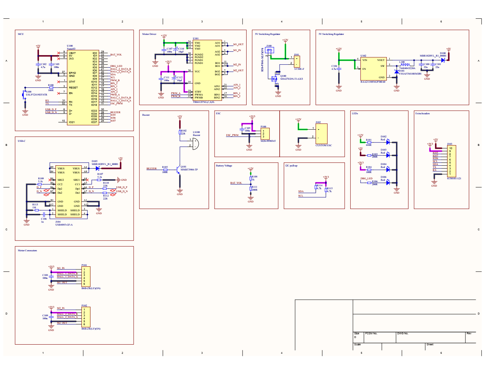
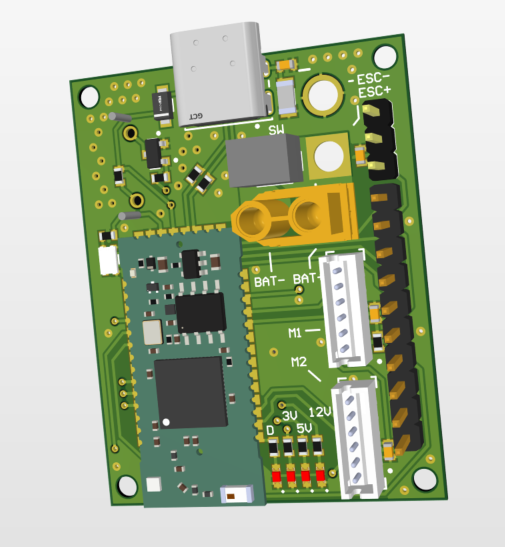
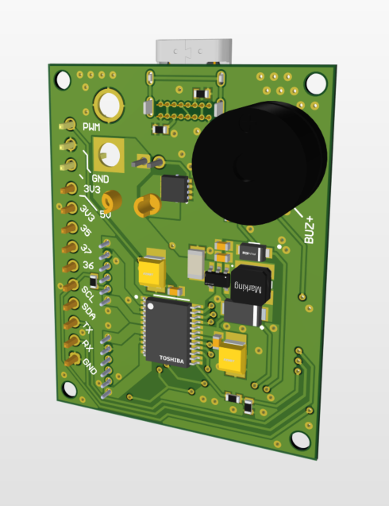
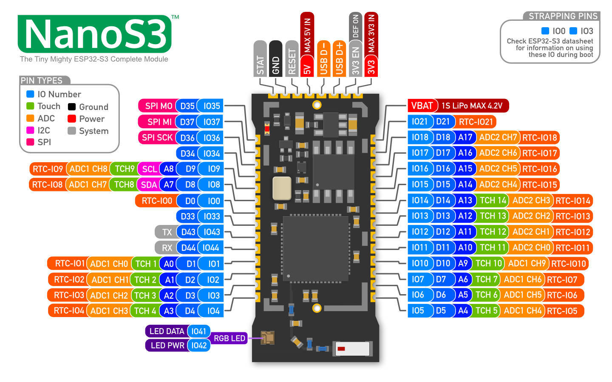

# Info

Skemaatik ja elektroonika muudatused kõik siia 

## Rev_1

Esimene rev mis ei jõudnud kaugemale arendusest oli joodetud otse protoboardile ESP-C6, TB6612FNG driver, buzzer, Regu ja headerid 
See ei läinud kasutusse sest on vaja S3 kergemaks Bluetooth ühenduseks, sest Liikmel juba kood olemas, C6 ei võimalda BluePad library (kui sain õigesti aru)

Seega S3 peale minek oli kõige loogilisem, aga S3 on palju suurem, uue ostmine pold halb idee, aga esimese deadline liikus edasi, sest unustasime regada, et läks korralikuma PCB designi peale, ehk Rev_2

## Rev_2

Teine Rev oli PCB design aga kasutades DevKiti, sest ei taha tekitada rohkem probleeme mida ei saa pärast hotfixiga parnada. Kui see töötab, siis ideaalis on Rev_3 see kui PCBl vahetatakse DevKit reaalse MCU-ga ära
Praegusel disainil on NanoS3, mis ei ole USB ühendusega, aga on toodud need pinnid välja. Switching regu on pandud selle toiteks ja LDO oleks võibolla old kahtlane (100-200mA ja 12.6V pealt 3.3V peale).

Loomulikult ka USB-C ja ka mitu erinevat headeri, mõned tavaliste gpiode jaoks, aku, switchi (power switch on FET controlled (Low side, sest high current suht)) ja ka mootorid.

Disain ise on 4 layer, Signal-GND-GND-Signal (Aku ja Fet polyd on kõigil neljal layeril, et oleks rohkem vaske jahutuseks)

Nano ise joodetakse SMD kujul peale, ning keskmine EPAD seal all samuti.

DBG LEDi kõrvale on veel kõigi 3 toite LEDid, 12V, 5V, 3V3

# Docs

## Schematic

## Layout

## ESP32-S3 (NanoS3) pinout

## Motor pinout

