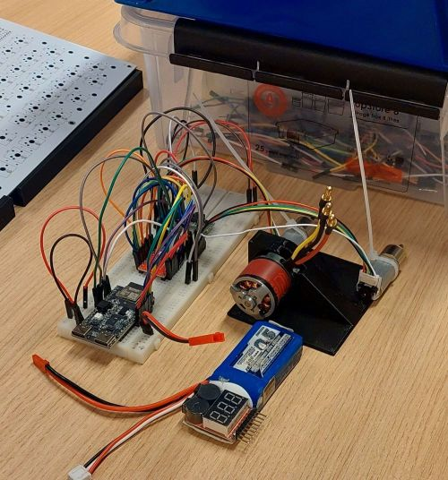

# Valdis

## First test bench 

## Info

**HETKEL PINOUT ON KÕIK VALE** 
Läksime üle PCB designile ja kasutuses nüüd ESP32 S3 (NanoS3)

**Mini-battle bot Läti võistluseks (450g)**

### Komponendid

* 3-phase relva mootor
* ESC
* 2 Mootorit liikumiseks (kursuse omad)
* 2 TB6612FNG
* ESP32-C6
* 3S aku

Võibolla kasutusse võtta ESP32-C6-Mini (11 GPIO) 
Meil vaja 11 (12): 
* Driver võtab 3per mootor = 6 kokku
* Mootori enkooderid veel 2x2=4 kokku
* ESC võtab PWM, ehk 1 kokku
* Võibolla ka EN nupp vms = 1 kokku

### Keha

Keha tuleks Resin või mingi 3D print, kõik komponendid kaaluvad 202g, ehk 230g enam vähem mängimis ruumi. 
Enne tehtud proto (mis ka liiga väike), on 64g, et suht OK

Relvale teha mingi lindiga või sarnane ülekande mehhanism, et saaks mootori keresse peita ja ei saaks otse laksu teistelt

### Proge/RC

Kaugelt juhib läbi bluetoothi, arvatavasti sama millega Jaan juhib 
Puldiks võtta mingi Xbox controller millel on bluetooth receiver juba olemas

### MCU pinout

* PWM
  * PWMA - GP23
  * PWMB - GP22
* A IN
  * AIN2 - GP21
  * AIN1 - GP20
* B IN
  * BIN2 - GP19
  * BIN1 - GP18

* ESC (NOT CONNECTED YET)
  * ESC PWM - GP6

* Enkooder Mootor A
  * Kollane (B) - GP2
  * Roheline (A) - GP3
* Enkooder Mootor B
  * Kollane (B) - GP0
  * Rohleine (A) - GP1

### Power
* 12V aku - regulator - 3.3V
  * 3.3V toidab MCU ja DRV loogika ja enkooderi VCC
* 12V toidab DRV switching
* STBY - otse 3.3V ehk HIGH ja constant ON

### Enkooder

Enkoodril on 7x35 impulssi pöörde kohta, vist 
Vaja teha koodis et kontrolliks kiirust ja hoiaks sama erinevalt pingest ja nh soidaks ka otse kui uks vasib ara

